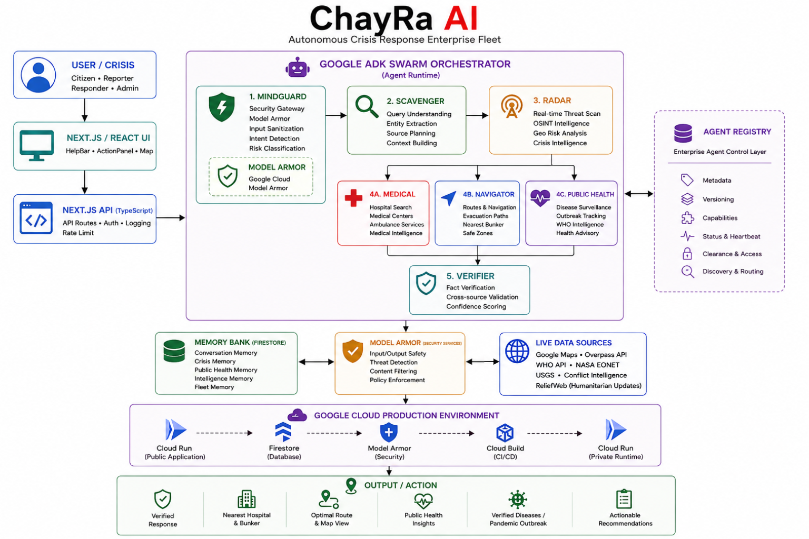

# ChayRa AI

### Autonomous Crisis Response Enterprise Fleet

> **When the World Breaks, ChayRa Responds.**

[](https://nextjs.org/)
[](https://google.github.io/adk-docs/)
[](https://cloud.google.com/vertex-ai)
[](https://cloud.google.com/run)
[](https://firebase.google.com/docs/firestore)
[](https://cloud.google.com/security/products/model-armor)
[](https://youtu.be/X2GPxNOW8BQ)

ChayRa AI is an autonomous, multi-agent crisis-response system designed to move beyond conversational AI.

Instead of waiting for a user to request one answer at a time, ChayRa activates a coordinated enterprise-style agent fleet that can interpret a crisis, gather live intelligence, find actionable destinations, analyze public-health signals, cross-check evidence, persist operational state, and return verified actions through a live tactical interface.

---

## Live Production Demo

**Hosted Application:**  
https://chayra-ai-service-936258611923.us-central1.run.app


### Demo Video

[](https://www.youtube.com/watch?v=X2GPxNOW8BQ)


**Source Code:**  
https://github.com/ranajitdharpersonal/chayraai

---

## Why ChayRa?

Most AI systems answer questions.

**ChayRa coordinates a response.**

A single crisis request can trigger a governed agent fleet that combines
live intelligence, real-world navigation, public-health analysis,
evidence verification and persistent operational memory.

> **One request. Multiple specialist agents. One verified operational response.**

---

```markdown
## Why This Fits the Fortified Enterprise Fleet Track

ChayRa was intentionally engineered around the four capabilities emphasized by this track:

**Discovery & Lifecycle** — A custom enterprise agent control layer manages agent metadata, versions, capabilities, status, heartbeat, clearance, discovery and routing.

**Core Execution & State** — Google ADK coordinates the fleet, while Firestore provides persistent operational memory and a private autonomous runtime supports background execution beyond a single request.

**Security & Governance** — MindGuard places Google Cloud Model Armor in the request path before downstream crisis processing, with Google Cloud service identity and clearance-aware agent execution.

**Telemetry** — Trace IDs, ADK events, fleet heartbeat and Cloud Logging provide visibility into what the fleet actually did.

The implementation uses a custom enterprise registry/control layer on top of Google ADK and Google Cloud services, rather than claiming direct use of every managed Gemini Enterprise Agent Platform component.

This gives ChayRa fine-grained control over crisis-specific orchestration, specialist routing, external intelligence, persistence and failure handling while remaining Google Cloud-native.
```

---

## The Core Idea

```text
A crisis request
      ↓
MindGuard
      ↓
Scavenger
      ↓
Radar
      ↓
┌────────────┬─────────────┬────────────────┐
│  Medical   │  Navigator  │  Public Health │
└────────────┴─────────────┴────────────────┘
      ↓
Verifier
      ↓
Memory + Security + Live Intelligence
      ↓
Verified Action
```

ChayRa is not designed as a single chatbot. It is a coordinated crisis-response fleet in which specialized agents work together to turn ambiguous requests into operational results.

---

## The Problem

Crisis response is rarely a single-question problem.

A real emergency may require several decisions at once:

- What is happening?
- Is the request safe to process?
- What threats are active nearby?
- Which medical resources are reachable?
- Where is the nearest shelter or bunker?
- Are there verified public-health alerts?
- Which claims can be trusted?
- What should the user do next?

Traditional chat interfaces usually answer one layer at a time and depend heavily on the user to perform the next step.

In a crisis, that coordination cost matters.

---

## The Solution

ChayRa turns one crisis request into a coordinated multi-agent workflow.

```text
User
 ↓
Safety + intent analysis
 ↓
Crisis context extraction
 ↓
Live threat intelligence
 ↓
Parallel specialist execution
 ├── Medical
 ├── Navigator
 └── Public Health
 ↓
Evidence verification
 ↓
Persistent operational state
 ↓
Map + tactical recommendations
```

The result is a system designed to **act through the workflow**, not simply describe it.

---

## What ChayRa Can Do

### 🚨 Emergency Response

Understand an emergency request and activate the appropriate crisis-response workflow.

### 🛡️ Safety & Governance

MindGuard uses Google Cloud Model Armor as an inline safety gate before downstream crisis processing.

### 🛰️ Live Crisis Intelligence

Radar combines external intelligence sources to build a live tactical picture.

### 🏥 Medical Support

Medical analyzes emergency context and returns medical-response guidance.

### 🧭 Real-World Navigation

Navigator searches for nearby hospitals, clinics, shelters and bunkers and can return real destination coordinates for map-based action.

### 🦠 Public Health Intelligence

Public Health combines trusted health intelligence, including WHO Disease Outbreak News and ReliefWeb when configured, with historical snapshot fallback.

### 🔎 Evidence Verification

Verifier cross-checks crisis information and produces an evidence-oriented response panel.

### 🧠 Persistent Operational Memory

Firestore-backed memory preserves crisis state, public-health intelligence, historical events and fleet state.

### 🌐 Tactical Command Interface

A live Next.js command interface unifies telemetry, maps, tactical intelligence, verification and response actions.

---

## The Autonomous Agent Fleet

| Agent | Responsibility |
|---|---|
| **MindGuard** | Security gateway, Model Armor sanitization and emergency safety classification |
| **Scavenger** | Crisis context extraction, entity understanding and source/search planning |
| **Radar** | Live crisis intelligence, threat scanning and geopolitical/environmental intelligence |
| **Medical** | Emergency medical and trauma-response analysis |
| **Navigator** | Nearby hospitals, shelters, bunkers, routes and tactical destinations |
| **PublicHealth** | Disease/outbreak intelligence, health advisories and public-health analysis |
| **Verifier** | Evidence generation, cross-source validation and confidence-oriented verification |

> The key design choice is not simply having multiple agents — it is having a governed runtime that coordinates them as a fleet.

### Fleet Execution Pattern

```text
                ┌───────────────┐
                │   MindGuard   │
                └───────┬───────┘
                        ↓
                ┌───────────────┐
                │   Scavenger   │
                └───────┬───────┘
                        ↓
                ┌───────────────┐
                │     Radar     │
                └───────┬───────┘
                        ↓
        ┌───────────────┼────────────────┐
        ↓               ↓                ↓
     Medical         Navigator       Public Health
        └───────────────┼────────────────┘
                        ↓
                  ┌───────────┐
                  │  Verifier │
                  └───────────┘
```

The orchestration root is implemented with Google ADK. ChayRa wraps its specialist registry handlers as ADK agents and executes the core crisis path sequentially followed by parallel specialist execution and final verification.

---

### From Intent to Action

ChayRa is designed to convert a natural-language crisis request into a real-world operational result — not just a generated answer.

## End-to-End Crisis Flow

A typical request follows this path:

```text
1. User enters a crisis request
          ↓
2. HelpBar sends the request to /api/swarm
          ↓
3. MindGuard performs security verification
          ↓
4. Scavenger extracts context and tactical requirements
          ↓
5. Radar fetches live crisis intelligence
          ↓
6. Medical + Navigator + Public Health execute in parallel
          ↓
7. Verifier generates an evidence-oriented result
          ↓
8. ChayRa persists the situation state
          ↓
9. High/critical threats can trigger resilience prediction
          ↓
10. Results return to the ActionPanel and live map
```

---

## Real-World Intelligence

ChayRa is designed to combine agent reasoning with external real-world data instead of relying only on model knowledge.

### Current Intelligence Sources

- **NASA EONET** — global environmental and event intelligence
- **USGS** — seismic and geologic intelligence
- **Conflict / war-zone intelligence** — tactical crisis context
- **WHO Disease Outbreak News** — trusted public-health reporting
- **UN ReliefWeb** — additional humanitarian intelligence when configured
- **OpenStreetMap Overpass** — real-world facility discovery including hospitals, clinics, shelters and bunkers
- **Google Cloud Model Armor** — safety/security verification

---

## Tactical Navigation

Navigator is designed for real-world action, not generic recommendations.

When coordinates are available, it performs a targeted facility search and can return:

```text
Hospital / Clinic
Shelter / Bunker
Distance
Latitude / Longitude
Navigation text
```

The result is forwarded through the ADK event path and surfaced in the frontend map.

### Production-Proven Behavior

In live production testing, Navigator successfully resolved real hospital and shelter/bunker destinations with distance and destination coordinates, allowing the frontend map to distinguish real navigation data from fallback responses.

---

## Public Health Intelligence

The Public Health agent is designed around trusted-source intelligence and persistence.

```text
WHO / ReliefWeb
      ↓
30-day intelligence scan
      ↓
Health analysis
      ↓
Outbreak reports + advisory
      ↓
Firestore snapshot
      ↓
Frontend public-health panel + map
```

When live model analysis is temporarily unavailable, ChayRa preserves the most recent verified public-health snapshot instead of failing to an empty state.

This allows the system to continue surfacing trusted outbreak intelligence while clearly distinguishing live analysis from persisted verified information.

---

## Memory & Resilience

ChayRa uses a Firestore-backed memory layer for persistent operational intelligence.

The memory system supports:

- crisis situation state
- historical threat retrieval
- public-health snapshots
- event and response history
- agent/fleet state
- resilience prediction for higher-severity situations

The system is designed to preserve useful state even when an individual upstream model or intelligence call temporarily fails.

---

## Security & Governance

Security is part of the execution path rather than a post-processing step.

### Model Armor

MindGuard uses Google Cloud Model Armor before downstream crisis processing.

```text
User Input
   ↓
Model Armor / MindGuard
   ├── MATCH_FOUND → Block
   └── NO_MATCH_FOUND → Continue
```

### Runtime Identity

Production Cloud Run services use Google Cloud service-account identity and Application Default Credentials rather than embedding production credentials into the application image.

### Agent Governance

ChayRa maintains its own enterprise agent control layer for metadata, versioning, capabilities, status and clearance — giving the fleet a controlled discovery and execution path around Google ADK.

---

## Architecture



### High-Level System Flow

```text
User
  ↓
Next.js / React UI
  ↓
Next.js API Routes (TypeScript)
  ↓
Google ADK Swarm
  ↓
MindGuard → Scavenger → Radar
                     ↓
        Medical | Navigator | Public Health
                     ↓
                  Verifier
                     ↓
       ┌─────────────┼─────────────┐
       ↓             ↓             ↓
   Firestore     Model Armor   Live Sources
       └─────────────┼─────────────┘
                     ↓
              Google Cloud
                     ↓
            Verified Action
```

---

## Google Cloud Production Architecture

ChayRa is deployed with a public application service and a separately deployed private runtime service for autonomous/background workloads.

```text
                     Google Cloud
                           │
              ┌────────────┴────────────┐
              ↓                         ↓
     chayra-ai-service         chayra-ai-runtime
          PUBLIC                     PRIVATE
              │                         │
              └────────────┬────────────┘
                           ↓
                       Firestore
                           │
                      Agent State
                        Memory
                       Registry
```

### Production Components

- **Cloud Run — Public Service**: serves the hosted application and API routes
- **Cloud Run — Private Runtime**: private autonomous runtime service
- **Firestore**: persistent memory and agent registry state
- **Cloud Build**: container build, push and deployment pipeline
- **Google Cloud service account**: runtime identity and permissions
- **Model Armor**: security gateway
- **Cloud Logging / tracing**: production observability

---

## Production Evidence

ChayRa is live on Google Cloud Run and has been exercised through the complete crisis-response path.

### Verified in Production

- ✅ Google ADK multi-agent execution
- ✅ Model Armor security verification
- ✅ Real hospital / shelter / bunker discovery
- ✅ Real destination coordinates returned to the API
- ✅ Firestore persistence
- ✅ WHO public-health intelligence retrieval
- ✅ Verifier execution
- ✅ Public Cloud Run deployment
- ✅ Private runtime deployment
- ✅ Background radar execution

### Example Operational Result

A production Navigator execution successfully resolved real nearby hospital and shelter/bunker destinations and returned destination coordinates with an explicit real-data signal for frontend rendering.

---

## Why ChayRa Fits the Judging Criteria

### 40% — Innovation & Operational Utility

ChayRa turns one natural-language crisis request into an autonomous workflow spanning live threat intelligence, medical analysis, real-world navigation, public-health intelligence and evidence verification.

### 30% — Architectural Discipline & Tech Stack

The system combines Google ADK with a custom enterprise agent control layer, Firestore-backed memory, Model Armor security, structured agent execution and Google Cloud production infrastructure.

### 30% — Demo & Production Readiness

ChayRa is deployed on Cloud Run and has been exercised end-to-end with real external intelligence, real destination coordinates, persistent state and production security controls.


---

## Observability

ChayRa includes operational visibility across the agent fleet.

Examples include:

```text
Trace ID
Agent identity
Agent status
ADK events
Fleet heartbeat
Cloud Run request logs
Persisted registry state
Public-health source status
Navigator real-data resolution
```

A production Navigator result, for example, can be resolved with real destination coordinates and an explicit real-data flag before the API returns the result to the frontend.

---

## Failure Handling

Real-world crisis systems cannot assume every external dependency will always respond.

ChayRa therefore uses layered degradation:

```text
Model / API failure
      ↓
Agent-level fallback
      ↓
Persisted snapshot / prior state
      ↓
Safe operational response
```

Examples include:

- Public-health snapshot fallback
- Navigator fallback messaging
- Safe Model Armor degradation
- Persisted Firestore state
- Structured API error responses
- Local rescue-beacon fallback capability

The goal is to **fail safely rather than fail silently**.

---

## Tech Stack

### Frontend

- Next.js 16.3
- React 19
- TypeScript
- React Leaflet / Leaflet
- Tailwind CSS
- Lucide React
- Framer Motion

### Agent & AI

- Google ADK
- Google GenAI SDK
- Gemini 3.5 Flash
- Vertex AI
- Google Cloud Model Armor

### Google Cloud

- Cloud Run
- Firestore
- Cloud Build
- Google Cloud service accounts / IAM
- Cloud Logging / trace infrastructure

### Data & Intelligence

- NASA EONET
- USGS
- WHO Disease Outbreak News
- UN ReliefWeb
- OpenStreetMap Overpass
- Geospatial / mapping services

---

## Repository Structure

```text
chayraai/
├── src/
│   ├── app/
│   │   ├── api/
│   │   │   ├── background-radar/
│   │   │   ├── background-radar-worker/
│   │   │   ├── public-health/
│   │   │   ├── swarm/
│   │   │   └── test-models/
│   │   ├── layout.tsx
│   │   ├── page.tsx
│   │   └── globals.css
│   │
│   ├── components/
│   │   ├── ActionPanel.tsx
│   │   ├── HelpBar.tsx
│   │   ├── MapCore.tsx
│   │   └── MapWidget.tsx
│   │
│   └── core/
│       ├── adk/
│       │   ├── registry.ts
│       │   ├── registry-store.ts
│       │   ├── registry-heartbeat.ts
│       │   ├── memory.ts
│       │   └── runtime.ts
│       │
│       └── agents/
│           ├── mindguard.ts
│           ├── scavenger.ts
│           ├── radar.ts
│           ├── medical.ts
│           ├── navigator.ts
│           ├── publicHealth.ts
│           ├── verifier.ts
│           └── vault.ts
│
├── public/
├── Dockerfile
├── cloudbuild.yaml
├── next.config.ts
├── instrumentation.ts
├── package.json
└── README.md
```

---

## Local Development

### Requirements

- Node.js 20+
- npm
- Google Cloud project
- Required Google Cloud APIs enabled
- Firestore configured
- Model Armor configured
- Valid local development credentials / environment variables

### Install

```bash
git clone https://github.com/ranajitdharpersonal/chayraai.git
cd chayraai
npm install
```

### Environment

Create `.env.local` with the credentials and configuration required by your environment.

Typical production-related values include:

```env
GOOGLE_CLOUD_PROJECT_ID=
GOOGLE_CLOUD_LOCATION=
MODEL_ARMOR_LOCATION=
MODEL_ARMOR_TEMPLATE_ID=

GOOGLE_CLIENT_EMAIL=
GOOGLE_PRIVATE_KEY=

RELIEFWEB_APPNAME=
```

> Never commit secrets or private keys to Git.

### Run Locally

```bash
npm run dev
```

Open:

```text
http://localhost:3000
```

### Production Build

```bash
npm run build
npm start
```

---

## Deployment

ChayRa uses Cloud Build to create and deploy the production container image.

The deployment pipeline:

```text
Git commit
   ↓
Cloud Build
   ↓
Docker build
   ↓
Container image
   ↓
Container Registry
   ↓
Cloud Run public service
   ↓
Cloud Run private runtime
```

The production application currently runs on Google Cloud Run.

---

## Testing the Core Workflow

For a fast end-to-end check:

```text
1. Open the hosted application
2. Provide a location using GPS or Drop Pin
3. Enter a request such as:

   "I need help"

4. Observe:
   MindGuard
   Scavenger
   Radar

5. Watch the specialist agents execute:
   Medical
   Navigator
   Public Health

6. Review:
   Hospital / bunker result
   Map destination
   Public-health intelligence
   Truth verification
   Resilience state
```

---

## Production Evidence

ChayRa is live on Google Cloud Run and has been exercised through the complete crisis-response path.

### Verified in Production

- ✅ Google ADK multi-agent execution
- ✅ Model Armor security verification
- ✅ Real hospital / shelter / bunker discovery
- ✅ Real destination coordinates returned to the API
- ✅ Firestore persistence
- ✅ WHO public-health intelligence retrieval
- ✅ Verifier execution
- ✅ Public Cloud Run deployment
- ✅ Private runtime deployment
- ✅ Background radar execution

### Example Operational Result

A production Navigator execution successfully resolved real nearby hospital and shelter/bunker destinations and returned destination coordinates with an explicit real-data signal for frontend rendering.

---

## Hackathon Value

## The ChayRa Thesis

> **During a crisis, the AI should do more than answer. It should coordinate.**

A single request can activate safety verification, crisis understanding, live intelligence, medical reasoning, real-world facility search, public-health analysis, evidence verification, persistent state and actionable map output.

**That is the difference between a chatbot and an autonomous crisis-response fleet.**

---

### Demo Video

[Watch the full ChayRa AI demo on YouTube](https://youtu.be/X2GPxNOW8BQ)

### Judge Demo Flow

```text
Open ChayRa
   ↓
Set / confirm location
   ↓
"I need help"
   ↓
MindGuard
   ↓
Scavenger
   ↓
Radar
   ↓
Medical + Navigator + Public Health
   ↓
Verifier
   ↓
Hospital / Bunker + Map
   ↓
Public Health + Evidence
   ↓
Cloud Run / Google Cloud proof
```

> A polished demo video will show the live system rather than a simulated sequence.

---

## Known Limitations

ChayRa is an active crisis-response prototype and should not be treated as a substitute for official emergency services.

External intelligence sources can experience:

- rate limits
- temporary outages
- stale information
- regional coverage gaps

Model-based analysis can also encounter temporary capacity exhaustion. ChayRa therefore uses fallbacks and persisted snapshots where possible.

---

## Future Evolution

- deeper long-running autonomous workflows
- stronger multi-session identity and memory
- broader resilience forecasting
- richer offline / mesh-rescue capabilities

---

## Built With

**Next.js • React • TypeScript • Google ADK • Gemini • Vertex AI • Model Armor • Cloud Run • Firestore • Cloud Build • Leaflet • OpenTelemetry**

---

## Creator

### Ranajit Dhar

ChayRa AI is a solo-built autonomous crisis-response system created for the **All Things Agentic Hackathon**.

Built to explore one question:

> **What happens when AI stops being a chatbot and starts behaving like an operational response fleet?**

---

## License

This project is provided for hackathon and demonstration purposes.

Check the repository for the latest project-specific licensing terms.